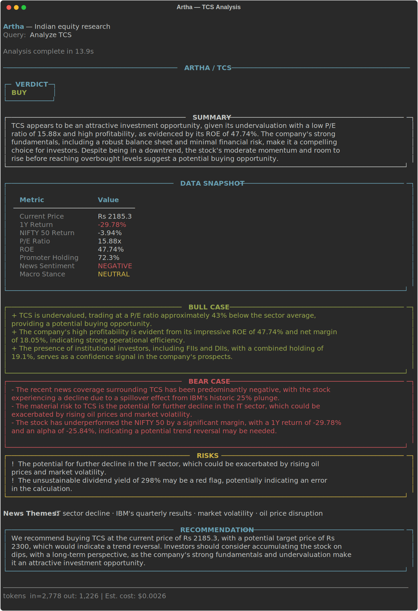
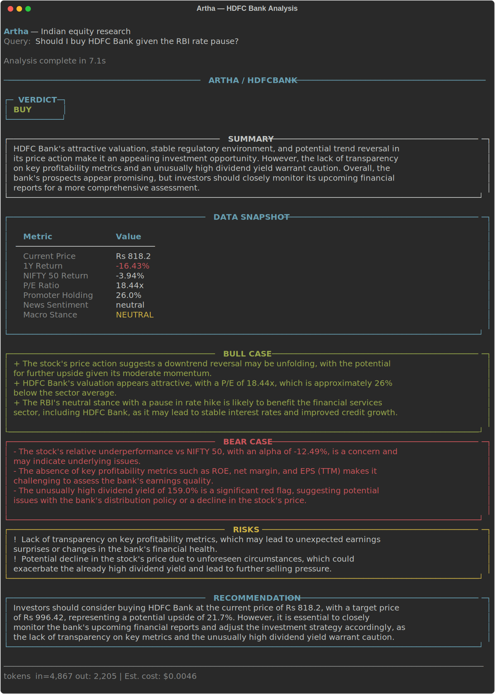

# Artha

Research tool for Indian equity markets. Point it at any NSE/BSE stock and it pulls price data, fundamentals, recent news, SEBI regulatory filings, and macro signals in parallel, then generates an investment memo with a BUY/HOLD/SELL verdict, bull/bear case, and risk flags.

   

---

## What it does

You ask a question like:

> *"Analyze HDFC Bank given the RBI rate pause"*

Artha deploys five agents concurrently:

| Agent | Responsibility |
|---|---|
| Market Data | Price action, RSI, moving averages, alpha vs NIFTY 50 |
| Fundamentals | P/E, ROE, ROCE, debt ratios, revenue trend |
| News & Sentiment | Last 30 days of news scored as POSITIVE / NEGATIVE / NEUTRAL |
| Regulatory | SEBI bulk deals, promoter holding, FII/DII ownership |
| Macro | RBI repo rate stance, FII flows, sector rotation |

The results feed into a final pass that writes the investment memo: verdict, bull case, bear case, and a specific price-level recommendation.

Past analyses are stored in ChromaDB. Follow-up queries on the same stock pull the previous memo as context.

---

## Architecture

```
User Query
    │
    ▼
Orchestrator
    │
    ├── Market Data Agent  ──→ yfinance (NSE prices, technicals)
    ├── Fundamentals Agent ──→ yfinance (P/E, ROE, margins)
    ├── News Agent         ──→ RSS (ET, Moneycontrol, BS) + NewsAPI
    ├── Regulatory Agent   ──→ NSE bulk deals, SEBI shareholding
    └── Macro Agent        ──→ RBI policy, FII/DII flows, sectors
           │
           ▼ (all 5 run in parallel)
    Memo Writer
           │
           ▼
    Investment Memo (JSON + Rich CLI)
           │
           ▼
    ChromaDB Memory (for future queries)
```

---

## Stack

| Layer | Technology |
|---|---|
| Language | Python 3.12 |
| API | FastAPI + Uvicorn |
| Inference | Anthropic Claude / OpenAI GPT-4o / Groq Llama (switchable via env var) |
| Market Data | yfinance (NSE/BSE) |
| News | RSS feeds + NewsAPI |
| Memory / RAG | ChromaDB (persistent vector store) |
| Cache | Redis 7 |
| Database | PostgreSQL 16 |
| Metrics | Prometheus + `/metrics` endpoint |
| Tests | pytest (unit + eval tests) |
| CI | GitHub Actions |
| Containers | Docker + Docker Compose |

---

## Running locally

**Prerequisites:** Python 3.12, Docker Desktop

```bash
# 1. Clone and set up
git clone <repo-url>
cd artha
cp .env.example .env
# edit .env and add your API key

# 2. Start infrastructure (Redis + Postgres)
docker-compose up redis postgres -d

# 3. Install dependencies
pip install -r requirements.txt

# 4. Run the demo CLI
python demo.py "Analyze TCS"
python demo.py "Should I buy Reliance Industries?"
python demo.py "HDFC Bank vs ICICI Bank, which is better?"

# 5. Or start the API server
uvicorn api.main:app --reload
# API docs at http://localhost:8000/docs
```

---

## API

| Method | Endpoint | Description |
|---|---|---|
| POST | `/api/v1/analyze` | Run full multi-agent analysis |
| POST | `/api/v1/recall` | Retrieve past analyses for a symbol |
| GET | `/api/v1/cost` | Token usage and cost for current session |
| GET | `/api/v1/health` | Health check |
| GET | `/metrics` | Prometheus metrics |

**POST /api/v1/analyze:**
```json
{ "query": "Analyze TCS and compare with Infosys" }
```

---

## Inference Provider

Switch between providers with a single env var, no code changes:

```env
LLM_PROVIDER=anthropic   # uses claude-sonnet-4-6
LLM_PROVIDER=openai      # uses gpt-4o
LLM_PROVIDER=gemini      # uses gemini-2.0-flash (free tier)
LLM_PROVIDER=groq        # uses llama-3.3-70b-versatile (free tier)
```

---

## Memory

Every analysis is saved to ChromaDB. Query the same stock again and the previous memo is included as context:

```
Day 1: "Analyze Reliance"         → full analysis, stored to memory
Day 2: "Any change in Reliance?"  → previous memo recalled, diff against new data
```

---

## Tests

```bash
# Unit tests
pytest tests/unit -v

# Eval tests (require real API key)
pytest tests/evals -v
```

Unit tests mock all external dependencies. Eval tests call the real API and check that verdicts are valid, summaries are non-trivial, and bull/bear cases have content.

---

## Docker

```bash
docker-compose up --build
```

---

## Supported Stocks

Any NSE/BSE listed stock. Common ones work by name:

`TCS`, `Reliance`, `HDFC Bank`, `Infosys`, `ICICI Bank`, `Wipro`, `SBI`, `Bajaj Finance`, `Kotak Bank`, `ITC`, `Maruti`, `Asian Paints`, `Sun Pharma`, `Titan`, `L&T`, `HCL Tech`

Or use NSE ticker directly: `BAJFINANCE.NS`, `PIDILITIND.NS`, etc.

---

## Screenshots

**TCS**



**HDFC Bank (RBI rate pause query)**


